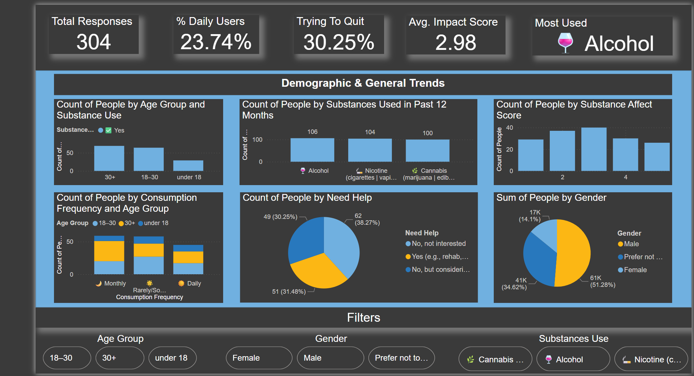

# Intoxicating Substance Consumption Analysis

This project aims to analyze the consumption patterns of intoxicating substances (such as alcohol, tobacco, and drugs) across different demographics using survey data. Insights are visualized through an interactive Power BI dashboard to support public health decisions and policy-making.

## 📊 Dashboard Preview

> _Preview of the Power BI dashboard showing demographic-wise consumption trends, substance comparison, risk levels, and key KPIs._

## 🔗 Dashboard Link

Access the live Power BI dashboard here:  
👉 [View the Power BI Dashboard](https://app.powerbi.com/view?r=eyJrIjoiOTAxOGY2YmEtZGYxMi00ZmZmLThkMTAtNjExZjdhNTU2NTc0IiwidCI6ImUxNGU3M2ViLTUyNTEtNDM4OC04ZDY3LThmOWYyZTJkNWE0NiIsImMiOjEwfQ%3D%3D&pageName=47f7194ab384e5fcf84a)

## 📁 Project Structure

## 📌 Key Features

- **Demographic Analysis**: Age, gender, and region-wise consumption statistics.
- **Substance Use Patterns**: Frequency and type of substances consumed.
- **Emoji-Based Feedback**: Data collected via interactive Google Forms using emojis for better engagement.
- **Risk Segmentation**: Classification of users into low, moderate, and high-risk groups.
- **Predictive Analysis**: Trends and possible health risk projections.

## 🧠 Technologies Used

- **Power BI** – for interactive visualizations.
- **Power Query** – for ETL (Extract, Transform, Load) operations within Power BI.
- **Google Forms** – for emoji-enhanced survey data collection.
- **Python (Pandas, Matplotlib)** – for data preprocessing and exploration.

## 📈 Insights Delivered

- 23.74% People Were Daily Users. 
- Alcohol and Tobacco emerged as the most consumed substances, followed by Cannabis.
- Substance use is common among youth, often influenced by peers, stress, and curiosity.
- Emoji-based questions improved engagement by over 30%.

## 📬 Contact

Created by **Jay Dev**  
📧 Email: [jay7080dev@gmail.com]  
🌐 LinkedIn: [linkedin.com/in/yourprofile](https://linkedin.com/in/jay7080dev)

---

> _Note: All sensitive information and identities were anonymized in compliance with ethical research standards._

